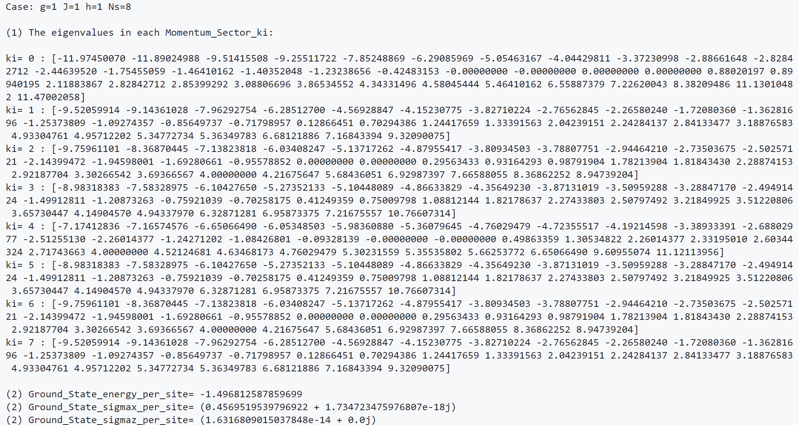

## Notes on `Nsite_ring.py`

---

### 1. Basic Principle

This homework discusses a **quantum spin-1/2 chain** of \(N\) sites arranged in a ring.  
The Hamiltonian is given by

\[
H = -\sum_{j=1}^{N} \Big( g\, \sigma_{j-1}^z \sigma_j^y \sigma_{j+1}^x+ J\, \sigma_j^z \sigma_{j+1}^z+ h\, \sigma_j^x
\Big),
\]

where \(\sigma^{x,y,z}\) are Pauli matrices, while the **periodic boundary condition** shows that \(\sigma_{N+1} = \sigma_1\).
This model includes both **two-spin** (\(\sigma^z\sigma^z\)) and **three-spin** (\(\sigma^z\sigma^y\sigma^x\)) interactions, with a transverse field \(h\).

The interplay among these competing terms governs the ground-state structure and excitation spectrum.

Because the Hamiltonian is invariant under lattice translation, we can use the **translation operator** \(T\):

\[
T |s_1, s_2, \ldots, s_N\rangle = |s_2, \ldots, s_N, s_1\rangle.
\]

Its eigenstates satisfy

\[
T |\psi_k\rangle = e^{-\mathrm{i} k} |\psi_k\rangle,
\qquad k = \frac{2\pi m}{N}\quad ( m=0,1,\ldots,N-1).
\]

The Hilbert space can thus be decomposed into **momentum sectors**, allowing a block-diagonal form of \(H\):
\[
H = \bigoplus_{k} H_k.
\]

Then we can calculate the eigenvalues in each block of H. Notice that the lowest eigenvalue across all \(k\) gives the **ground-state energy**, and its corresponding eigenvector gives the **ground-state vectors**.

Lastly, the ground-state expectation values are computed as

\[ \langle \sigma^x \rangle = \frac{1}{N}\sum_i \langle \psi_0|\sigma_i^x|\psi_0\rangle, \quad \langle \sigma^z \rangle = \frac{1}{N}\sum_i \langle \psi_0|\sigma_i^z|\psi_0\rangle. \]

---

### 2. Source Code of  `Nsite_ring.py`

#### (a) Hamiltonian

Firstly, we preset the parameters and prepare the Pauli matices to represent the spin operaters.
Then we define following function:

```python
def kron_n(op_list):
    res = np.array([[1]], dtype=complex)
    for op in op_list:
        res = np.kron(res, op)
    return res
```

to get the tensor product of the N-spin system.

For each site \(j\), the local contributions are built as: \(-g\,\sigma_{j-1}^z\sigma_j^y\sigma_{j+1}^x\), \(-J\,\sigma_j^z\sigma_{j+1}^z\), \(-h\,\sigma_j^x\) , and summed to form the total \(H\).

#### (b) Translation Operator

We build the translation matrix \(T\) that cyclically shifts basis states by one site, then diagonalizes it to find eigenvalues \(e^{-\mathrm{i} k}\):

```python
eigvals_T, eigvecs_T = np.linalg.eig(T)
```

#### (c) Diagonalization in Each Momentum Sector

We initial a dictionary named ```momentum_sectors``` with keys in 0-N, then we identify the variable ```k_index``` by following estimation to generate corrsponding keys for ```momentum_sectors``` :

```python
for i, eigenvalue in enumerate(eigvals_T):
    abs_phase = -cmath.phase(eigenvalue)
    if abs_phase < 0:
        abs_phase += 2 * np.pi
    k_index = round(abs_phase * N / (2 * np.pi)) % N
    momentum_sectors[k_index].append(i)
```

For each momentum sector, the Hamiltonian is projected as

\[
H_k = V_k^\dagger H V_k
\]

where \(V_k\) is composed by the eigenvectors of the matrix T:

```python
for k_index in range(N):
    indices = momentum_sectors[k_index]
    ...
    Vk = eigvecs_T[:, indices]
    Hk = Vk.conj().T @ H @ Vk
    Ek, psi_k = eigh(Hk)
```

Then we can identify the ground state by:

```python
    if Ek[0] < ground_energy:
            ground_energy = Ek[0]
            ground_state = Vk @ psi_k[:, 0]
```

#### (d) Ground State Properties

\(\langle\sigma_x \rangle\) and \(\langle\sigma_z \rangle\) can be calculated as follow:

```python
for j in range(N):
    ops_x = [id2] * N
    ops_x[j] = sx
    op_x_j = kron_n(ops_x)
    sigmax_exp += np.vdot(ground_state, op_x_j @ ground_state)
sigmax_exp /= N
...
```

In the end, to prominent the output, we build a function ```Format_complex``` with accuracy at  ```threshold = 1e-10```, by which we can get the round results.
(see in the code annotation)

---

### 3. Numerical Results and Analysis

The output in cases \( g = J = h = 1, N = 8 \)  :



#### (1) Spectrum Interpretation

The energy dispersion \(E(k)\) shows multiple excitation bands.  
The smooth variation with \(k\) implies quasi-particle-like excitations, similar to magnons in simpler spin models.

#### (2) Ground-State Properties

- The lowest eigenvalue **-11.97450070** (ground state energy in total) appears at **\(k=0\)**, meaning that the ground state preserves translational symmetry.  
- The expectation value \(\langle \sigma^x \rangle \approx 0.457\) indicates partial alignment along the transverse field, say the polarization.
- \(\langle \sigma^z \rangle \approx 0\) suggests no longitudinal magnetization, showing the field dominates the spin order.
- Imaginary shows no contribution to the expection of observations.

---

### 4. Summary

This work implemented a complete diagonalization of a quantum spin chain with periodic boundary conditions.  
Through translation symmetry, the computation was simplified by dividing the Hilbert space into momentum sectors.