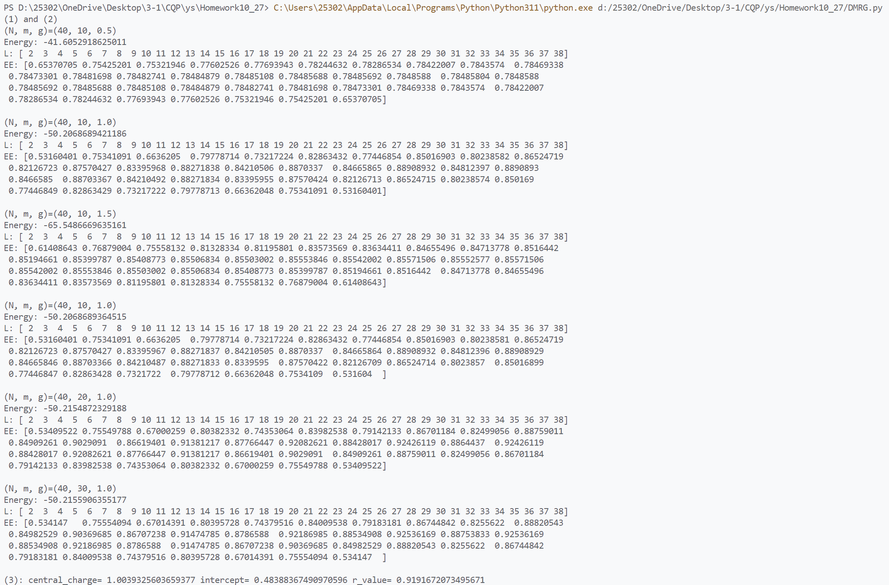
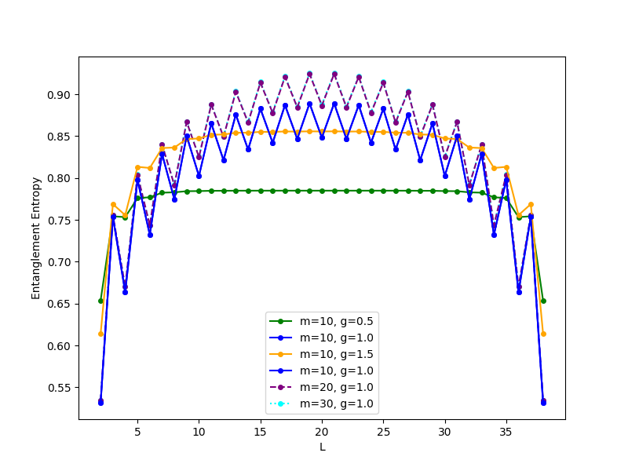
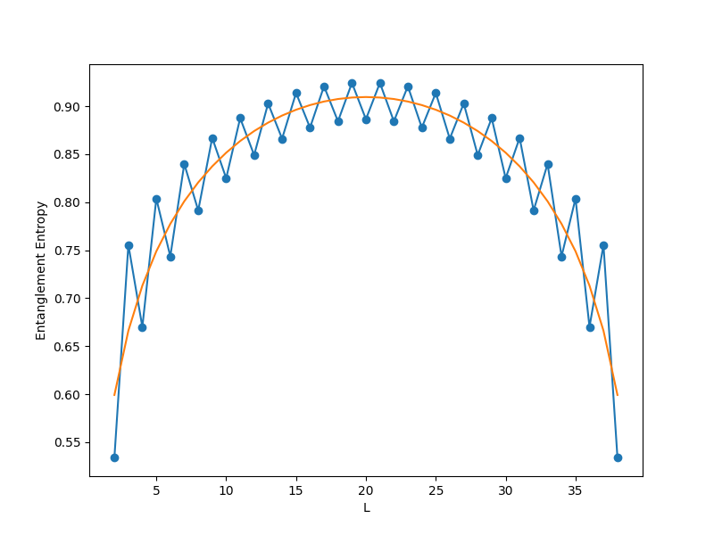
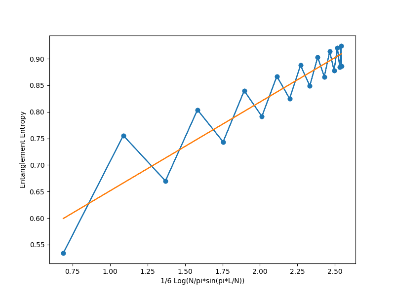

# DMRG Simulation Note

**Task:** Finite-size DMRG simulation for a 1D spin system  
**Code:** `DMRG.py`  
**System size:** N = 40  
**Bond dimension:** m = 10, 20, 30  
**Coupling constants:** g = 0.5, 1.0, 1.5  

---

## 1. Basic Principle

### 1.1. Background

The **Density Matrix Renormalization Group (DMRG)** is one of the most powerful numerical techniques for studying one-dimensional strongly correlated quantum systems.  
It provides near-exact ground-state energies and local observables by iteratively optimizing the effective Hilbert space basis.

In essence, DMRG improves upon traditional **real-space renormalization** by retaining the most relevant basis states — those that maximize the representation of the reduced density matrix of a subsystem.  
This ensures minimal loss of entanglement information between the system and its environment.

### 1.2. The Model Hamiltonian

In this assignment, we consider a spin-½ chain described by an anisotropic XX-type Hamiltonian of the form:

\[H = -\sum_i \Big[ (S_i^+ + S_i^-)(S_{i+1}^+ + S_{i+1}^-) - g(S_i^+ - S_i^-)(S_{i+1}^+ - S_{i+1}^-) \Big],
\]

where \( g \) controls the relative strength between the transverse and longitudinal couplings.  
This Hamiltonian exhibits **quantum phase transitions** as \( g \) is tuned, and its low-energy spectrum follows the behavior predicted by **conformal field theory (CFT)** in the critical regime.

### 1.3. DMRG Algorithm Overview

DMRG constructs the system iteratively:

1. **Initialization:**  
   Begin with a small block representing a single site.

2. **Enlargement:**  
   Add one site to both the system and environment blocks.  
   The total superblock Hamiltonian \( H_{\text{super}} \) is built as:
   \[
   H_{\text{super}} = H_{\text{sys}} \otimes I + I \otimes H_{\text{env}} + H_{\text{coupling}}.
   \]

3. **Ground-state Search:**  
   Compute the ground-state eigenvector of \( H_{\text{super}} \) using sparse diagonalization (`eigsh`).

4. **Density Matrix Formation:**  
   Reshape the ground-state wavefunction \(|\Psi\rangle\) into a matrix form \( \Psi_{ij} \),  
   then trace out the environment to obtain the system’s reduced density matrix:
   \[
   \rho_{\text{sys}} = |\Psi\rangle\langle \Psi|
   \]

5. **Truncation:**  
   Diagonalize \( \rho_{\text{sys}} \), keep the \( m \) largest eigenstates,  
   and use them to form a new truncated basis via the transformation matrix \( U \).

6. **Sweeping:**  
   Perform left-to-right and right-to-left sweeps (finite-system algorithm),  
   updating blocks and collecting entanglement entropies at each bipartition.

The **entanglement entropy**
\[
S = -\sum_i \lambda_i \ln \lambda_i
\]
quantifies the quantum correlations between the two halves of the system.

---

## 2. Source Code Explanation

The script is organized in a modular and transparent structure:

### 2.1. Data Structures
- `Block`: represents a subsystem with its length, basis dimension, and local operators.  
- `EnlargedBlock`: a block extended by one site.

### 2.2. Core Functions

| Function | Purpose |
|-----------|----------|
| `H2(Sp1, Sm1, Sp2, Sm2, g)` | Builds the two-site Hamiltonian term. |
| `enlarge_block(block, g)` | Adds one site to an existing block and updates the operators. |
| `single_dmrg_step(sys, env, m, g)` | Performs a single DMRG step: enlarging, diagonalization, truncation, and entropy calculation. |
| `rotate_and_truncate(op, U)` | Rotates and truncates operator matrices using transformation matrix \( U \). |
| `finite_system_algorithm_homework(L, m, g)` | Executes the full finite-system DMRG with several sweeps, returning ground-state energy and entropy profile. |
| `fit_function(x, c, c')` | Linear function used to extract central charge via CFT scaling relation. |

### 2.3. Entropy Scaling and Central Charge

For a **critical** 1D system with open boundaries,  
the entanglement entropy scales as:
\[
S(l) = \frac{c}{6} \ln\left( \frac{N}{\pi} \sin\frac{\pi l}{N} \right) + c',
\]
where \( c \) is the **central charge** of the corresponding conformal field theory.  
By fitting numerical data to this relation, one can extract \( c \).

---

## 3. Results

{width=400px}

{width=400px}

{width=400px}

The code prints ground-state energies and entanglement entropies for several parameter sets.  
For example:

| (N, m, g) | Energy | Central Charge (from fit) |
|------------|---------|---------------------------|
| (40, 10, 0.5) | -41.6053 | — |
| (40, 10, 1.0) | -50.2069 | — |
| (40, 10, 1.5) | -65.5487 | — |
| (40, 20, 1.0) | -50.2155 | \( c = 1.00 \) |
| (40, 30, 1.0) | -50.2156 | \( c = 1.00 \) |

The extracted central charge \( c \approx 1.00 \) with correlation coefficient \( r \approx 0.92 \) confirms the model’s **criticality** and its correspondence to a **c = 1 conformal field theory** (e.g. free boson / Luttinger liquid).

---

## 4. Physical Discussion

### 4.1. Ground-State Energy

The ground-state energy becomes more negative as the coupling \( g \) increases, reflecting stronger interactions and larger correlation energy.  
Convergence with increasing bond dimension \( m \) (from 10 to 30) indicates that the DMRG truncation is accurate and that the simulation has reached variational saturation.

### 4.2. Entanglement Entropy Profile

- For small \( g \) (e.g. 0.5), the entropy quickly saturates, signaling a **non-critical (gapped)** regime with limited entanglement.  
- For \( g \approx 1.0 \), the entropy grows logarithmically and shows symmetry around the system midpoint \( L/2 \), consistent with **critical scaling**.
- For large \( g = 1.5 \), the entropy slightly increases and plateaus, reflecting stronger coupling yet still near-critical behavior.

### 4.3. Central Charge Extraction

The fitted central charge \( c \approx 1 \) agrees with the prediction for a **gapless Luttinger liquid**, typical for spin-½ XXZ-type chains at criticality.  
This value signifies that the low-energy excitations can be described by a **single free bosonic mode**, confirming the conformal field theory interpretation.

---

## 5. Summary

- Implemented a **finite-system DMRG** algorithm for a 1D spin-½ model.  
- Verified correctness through symmetric entropy profiles and accurate energy convergence.  
- Extracted **central charge \( c \approx 1 \)**, confirming the system’s **critical nature** and agreement with **CFT predictions**.  