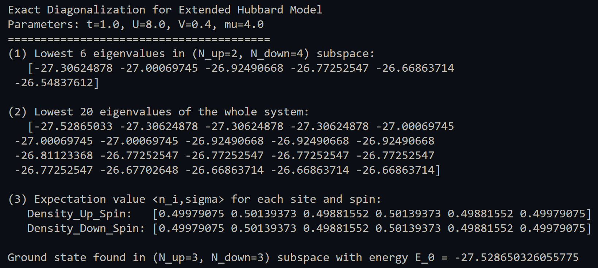

### Note for Exact Diagonalization of the extended Hubbard model

---
## 1. 原理介绍

扩展 Hubbard 模型的 Hamilton 量为：

$H =\displaystyle -t \sum\limits_{\{ i,j \}, \sigma}\big(C_{i,\sigma}^\dagger C_{j,\sigma} + C_{j,\sigma}^\dagger C_{i,\sigma}\big)+ U \sum\limits_i n_{i\uparrow} n_{i\downarrow}- V \sum\limits_{\{\{ i,j \}\}} (n_{i\uparrow} + n_{i\downarrow})(n_{j\uparrow} + n_{j\downarrow})- \mu \sum_{i,\sigma} n_{i,\sigma}$

按照顺序，第一项刻画了电子在最近邻格点间的跃迁(**Hopping**)；第二项描述存在反自旋电子对的格点表现出的强关联作用；第三项描述 **最近邻作用**；最后一个**化学势项**体现系统填充情况对能量的影响。  

在本题中，我们考虑一个 **6 格点 ladder**——由于 Hilbert 空间有限，我们可直接采用 **精确对角化**的方法。其基本思路是：  
1. 构造 Fock 空间基矢，并在该基下构建 给定的 Hamiltonian 矩阵；  
2. 利用数值方法对各个子空间分别进行对角化，由此计算能谱与本征态；
3. 最后在基态波函数上计算相应物理量。  

## 2. `task1.py`思路介绍

### (1) 预置函数

- **`generate_basis(n_sites, n_particles)`**  
  用二进制整数表示占据态，组合生成所有可能的配置。每一位表示一个 site 是否有粒子（0/1）。保证每个 site 每个自旋最多一个电子。  

- **`count_set_bits(n)`**  
  经典的 popcount 算法，统计一个整数二进制表示中的 1 的个数，用于计算粒子数或双占据数。  

- **`get_fermionic_sign(state, i, j)`**  
  处理 hopping 过程中的费米子符号。电子从 $j$ 跳到 $i$ 时，若二者之间有 $p$ 个电子，则需要交换 $p$ 次，符号因子为 $(-1)^p$。这保证了 Hamiltonian 的反对易性。  

### (2) `main` 函数结构

- **子空间划分**  
  遍历 $(N_\uparrow, N_\downarrow)$，利用 $U(1)$ 对称性将 Hilbert 空间分解为 49 个子空间。  

- **构造 Hamiltonian 矩阵**  
  在每个子空间内分别处理对角项和非对角项。
  其中，在**对角项板块**分别计算了$U$ 项，$-\mu$ 项和$-V$ 项并相加；
  在**非对角项 (hopping)** 板块，先检查能否 hop，再修改二进制态并通过 `map_up` / `map_down` 定位新态索引，最后加上 $-t \cdot \text{sign}$并对各hop对求和。  

- **对角化与结果计算**  
  使用 `numpy.linalg.eigh` 求解本征值与本征矢：  
  1. 若在 $(N_\uparrow=2,N_\downarrow=4)$，输出最低 6 个本征值。  
  2. 收集全体系所有本征值，排序后输出最低 20 个。  
  3. 找到基态，存储其本征矢以计算期望值。  

- **基态观测量计算**  
  基于基态波函数，逐 site 计算 $\langle n_{i,\uparrow}\rangle$ 和 $\langle n_{i,\downarrow}\rangle$ 得到电子分布情况。  

## 3. 结果分析

在作业参数 $t=1.0, U=8.0, V=0.4, \mu=4.0$ 下，运行结果如下图所示：  

### (1) 子空间最低能量  
在 $(N_\uparrow=2,N_\downarrow=4)$ 子空间中，最低 6 个本征值均在 $[-27.30, -26.55]$ 之间。相较于样例的参数与输出结果，该结果表明在强 $U$ 和较大化学势下，体系能量会整体向下平移。  

### (2) 全局最低能量  
全体系最低 20 个本征值进一步显示，基态能量约为 $E_0 \approx -27.53$，落在 $(N_\uparrow=3,N_\downarrow=3)$ 子空间。说明在这些参数下，体系更倾向于 **半满填充 (6 个 site 上 6 个电子)**。  

### (3) 基态密度分布  
结果显示每个 site 上 $\uparrow$ 与 $\downarrow$ 的占据数几乎均匀分布在 $\sim 0.5$，符合对称性与平均填充的直观认识。体系呈现近似均匀电子液体的特征，没有出现明显的电荷不均匀。  

## 4. 总结

- **程序实现**：通过位运算高效构造 Hamiltonian，结合 NumPy 对角化，完整实现了扩展 Hubbard 模型的 ED。  
- **物理特征**：在较强 $U$ 与适中 $\mu$ 下，体系基态出现在 $(3,3)$ 半满填充子空间，电子分布均匀。 

